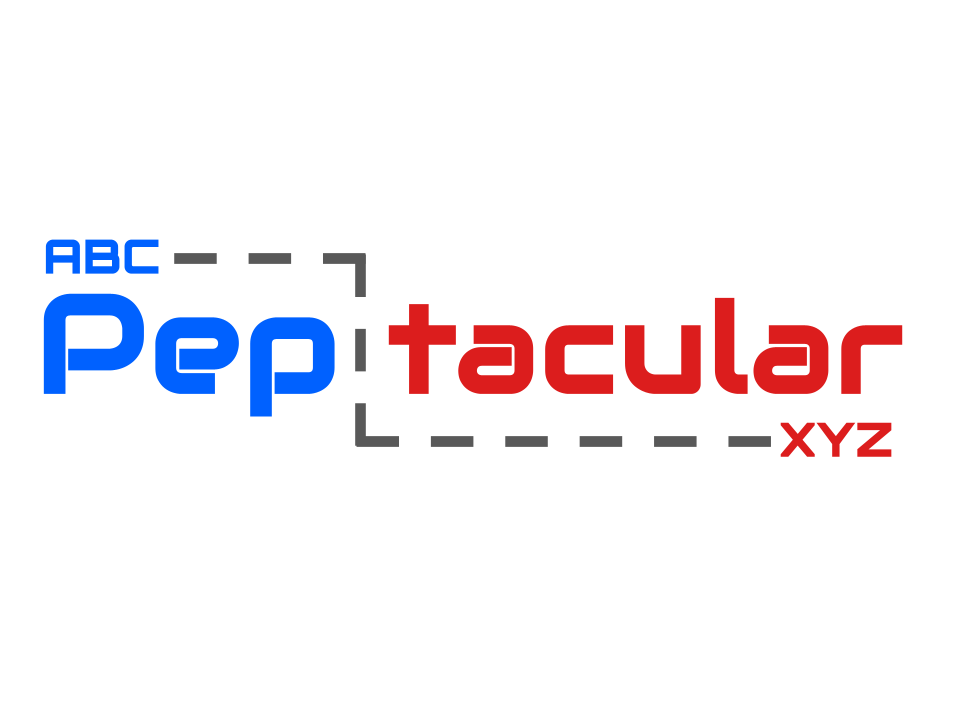

# Peptacular

<div align="center">
  
  
  # Peptacular
  
  A Python package for peptide sequence analysis built around **ProForma 2.1 notation**. Calculate masses, generate fragments, predict isotopic patterns, and more. Peptacular uses type annotations extensively, so it is type safe.
  
  [](https://github.com/tacular-omics/peptacular/actions/workflows/python-package.yml)
  [](https://codecov.io/github/tacular-omics/peptacular)
  [](https://badge.fury.io/py/peptacular)
  [](https://www.python.org/downloads/)
  [](https://opensource.org/licenses/MIT)
  
</div>

## Features

- **Nearly Complete ProForma 2.1 Parsing**
- **Modifiable ProFormaAnnotaion Objects (Factory Pattern)**
- **Mass/Mz/Composition Calculations**
- **Predicted Isotopic Distributions**
- **Enzymatic Protein Digestion** 
- **Fragment Ion Generation** 
- **Physiochemical Property Calculations** 
- **Built-in Parallel Processing** 

## Installation

```bash
pip install peptacular
```

## Quick Start (Object Based)

See docs for more detail.

```python
import peptacular as pt

# Parse a sequence into a ProFormaAnnotation
peptide: pt.ProFormaAnnotation = pt.parse("PEM[Oxidation]TIDE")

# Calculate mass and m/z
mass: float = peptide.mass()
mz: float = peptide.mz(charge=2)

# Facotry pattern
print(peptide.set_charge(2).set_peptide_name("Peptacular").serialize())
# (>Peptacular)PEM[Oxidation]TIDE/2
```

## Quick Start (Functional Based)

When more than one item is passed to the functional API methods, it is automatically parallelized.

```python
import peptacular as pt

peptides = ['PEPTIDE', 'PATRICK', 'GARRETT']

# Calculate mass and m/z for all peptides
masses: list[float] = pt.mass(peptides)
mzs: list[float] = pt.mz(peptides, charge=2)

# For single peptides 
mass: float = pt.mass(peptides[0])
mz: float = pt.mz(peptides[0], charge=2)
```


## ProForma 2.1 Compliance

See [PROFORMA_COMPLIANCE.md](PROFORMA_COMPLIANCE.md) for detailed compliance status.

## Contributing

Contributions welcome! Check the examples directory for code style and documentation patterns.

## License

MIT

## Citation

Working on a JOSS submission, but in the meantime use:

https://doi.org/10.5281/zenodo.15054278

